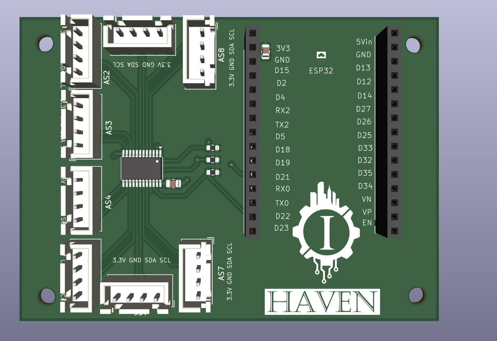
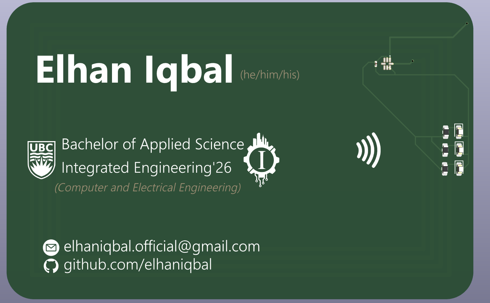
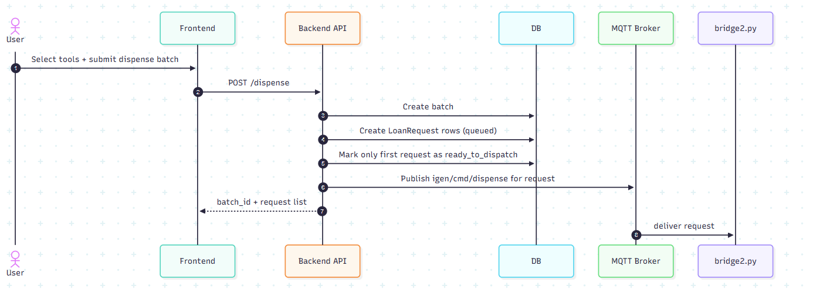
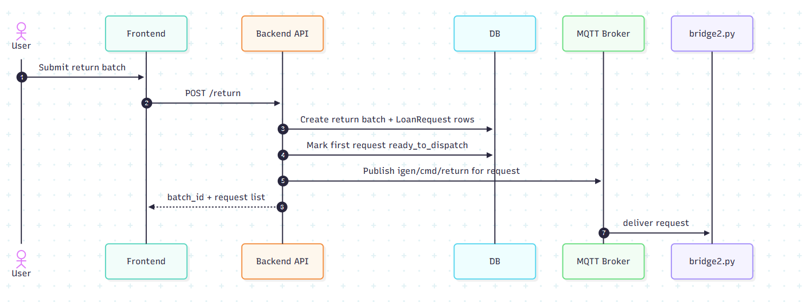
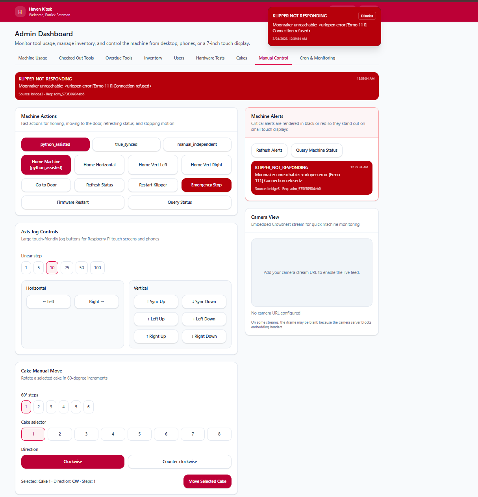
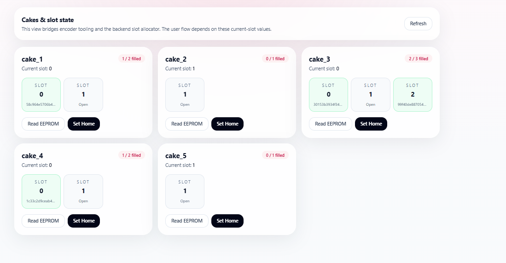

<div align="center">

# HAVEN

**Automated tool dispensing and return kiosk — UBC IGEN 430 Capstone**

[](https://python.org)
[](https://typescriptlang.org)
[](https://fastapi.tiangolo.com)
[](https://react.dev)
[](https://docker.com)
[](https://klipper3d.org)

</div>

---

A student taps their UBC card, selects tools on a touchscreen kiosk, and the machine retrieves them — a gantry positions itself over the right carousel, rotates it to the target slot, and presents the tool at the door. Returns work in reverse. The system tracks loans, flags overdues, and sends email alerts. Everything runs in Docker on a Raspberry Pi.

This is a capstone demo. It runs end-to-end on real hardware and was built with production in mind from the start — the session mechanism, schema, network isolation, and service topology are all production-quality decisions. Getting it the rest of the way is a set of specific, well-scoped additions, not a rewrite. More on that [below](#getting-to-production).

---

## Demo

<div align="center">
  <a href="https://youtu.be/GPG5MJTYQkU">
    
  </a>
  <br/><sub>▶ Click to watch on YouTube</sub>
</div>

---

## Architecture

```
┌──────────────────────────────────────────────────────────┐
│                 Raspberry Pi (Docker Compose)             │
│                                                          │
│  React Kiosk ──── HTTP polling ────► FastAPI Backend     │
│  (Nginx :8080)                       (Uvicorn :8000)     │
│                                      SQLite/SQLAlchemy   │
│                                            │             │
│                                       MQTT pub/sub       │
│                                            │             │
│                                  Eclipse Mosquitto       │
│                                   (1883 / WS:9001)       │
│                                            │             │
│                              ┌─────────────┴──────────┐  │
│                         Bridge sidecar      RFID sidecar │
│                         (bridge.py)        (rfid_service)│
│                              │                   │       │
└──────────────────────────────┼───────────────────┼───────┘
                               │ HTTP              │ SPI/GPIO
                        Moonraker API         MFRC522 reader
                        (:7125)
                               │ G-code macros
                            Klipper
                               │
                      BTT Octopus MAX EZ
                               │
              gantry1 / gantry2 / horiz / cake steppers
```

The frontend never touches hardware directly. It polls the backend over HTTP; the backend fires MQTT commands; the bridge translates those into Klipper G-code macros via Moonraker's HTTP API. Klipper handles all stepper control on the BTT Octopus board.

The bridge runs in one of two modes set via `BRIDGE_MODE`:
- `MOONRAKER` — real hardware via Moonraker's HTTP API
- `SIM` — software simulation with configurable timing and fail rate, no physical machine required

---

## Hardware

**Stepper axes**

- `horiz` — horizontal axis, positions the gantry over a carousel
- `gantry1`, `gantry2` — dual independent vertical axes, lifts tools in and out of slots
- `cake0`–`cake5` — one stepper per carousel, 60° per slot step

Each carousel ("cake") has 6 slots. The gantry moves horizontally to the target carousel, the vertical axes lower, the carousel rotates to the right slot, and the tool is picked up or deposited.

Vertical homing can't use Klipper's native `G28` because both gantry sides need to find their endstops independently. `vertical_home.py` handles this by jogging each side in 1600-step increments and polling Moonraker's endstop API until both trigger, then zeroing both steppers.

**Klipper macros (selected)**

```
SA_MOVE_TO_CAKE CAKE=<n>              position gantry over carousel n
SA_ROTATE_TO_SLOT CAKE=<n> SLOT=<s>   rotate carousel to absolute slot
MOVE_CAKE_CW_60 CAKE=<n>              rotate one slot clockwise
MOVE_CAKE_CCW_60 CAKE=<n>             rotate one slot counter-clockwise
SA_ROTATE_TO_DISPENSE CAKE=<n>        final alignment to dispense window
SA_MOVE_TO_DOOR                       extend gantry to door position
SA_PARK                               return to home/park
SA_HOME_HORIZONTAL                    home horizontal axis
SA_JOG_GANTRY_UP/DOWN DIST=<n>        manual jog (admin)
```

**Custom PCB — Encoder multiplexer**

<div align="center">

</div>

Each carousel has an AS5600 magnetic absolute encoder. Since all AS5600s share I2C address `0x36`, a TCA9548A multiplexer switches between them. An ESP32 reads all six, persists per-carousel zero offsets to EEPROM, and exposes a simple serial command interface.

When `ENCODER_SERIAL_ENABLED=1`, the bridge reads the angle before and after each carousel rotation and fires an alert if the measured delta is outside tolerance. Mismatches are logged and surfaced in the admin panel — it's a sanity check, not a safety gate; the operation still completes.

**NFC student card**

<div align="center">

</div>

The authentication card is a custom PCB — originally a personal side project to build a business-card-sized NFC tag. It turned out to be directly useful here: it's ISO 14443 compliant, so the MFRC522 reads it identically to any standard card. No firmware changes were needed.

---

## Sequence diagrams

<table>
<tr>
<td align="center">

<br/><sub>Dispense</sub>
</td>
<td align="center">

<br/><sub>Return</sub>
</td>
</tr>
</table>

Full diagrams with per-stage MQTT events and Moonraker calls: [`docs/system-overview.md`](docs/system-overview.md)

---

## Screenshots

<table>
<tr>
<td align="center"><br/><sub>Admin panel — manual gantry and carousel control</sub></td>
<td align="center"><br/><sub>Carousel slot state view</sub></td>
</tr>
</table>

---

## Poster

<div align="center">

</div>

---

## Stack

| | |
|---|---|
| Frontend | React 18, TypeScript, Vite, Tailwind CSS |
| Backend | Python 3.11, FastAPI, SQLAlchemy 2.0, Pydantic |
| Messaging | Eclipse Mosquitto 2, Paho |
| Database | SQLite (WAL mode) |
| Motion control | Klipper, Moonraker HTTP API |
| Firmware | Arduino/PlatformIO, ESP32, AS5600, TCA9548A |
| Infrastructure | Docker Compose, Nginx |
| Notifications | SendGrid |
| Hardware | BTT Octopus MAX EX, MFRC522 RFID, NEMA steppers |

---

## Getting started

**Prerequisites:** Docker, Docker Compose, Git

### 1. Clone and configure

```bash
git clone https://github.com/elhaniqbal/igen-shop-assistant.git
cd igen-shop-assistant
```

Create a `.env` in the repo root. Minimum to run without hardware:

```env
DATABASE_URL=sqlite:////app/data/igen.db
MQTT_BROKER=mqtt
MQTT_PORT=1883

# SIM runs without any physical hardware attached
BRIDGE_MODE=SIM

# Set to 1 to mock RFID scans in the browser
VITE_MOCK=1

# Only used in MOONRAKER mode
MOONRAKER_URL=http://host.docker.internal:7125

SENDGRID_API_KEY=
SENDGRID_FROM_EMAIL=
```

### 2. Build and start

```bash
docker compose up --build
```

| Service | URL |
|---|---|
| Kiosk | http://localhost:8080 |
| Backend API | http://localhost:5000 |
| MQTT Web UI | http://localhost:8090 |
| DB Admin | http://localhost:8083 |

The database is created automatically at `./data/igen.db` on first run.

> `5000:8000` is a dev convenience. In production, remove the port mapping — the backend is already on the `internal` Docker network and Nginx proxies it. Nothing outside the host should reach port 8000 directly.

### 3. Create the first admin user

There's no seed data. `POST /api/admin/users` has no auth guard (see [rough edges](#rough-edges)), so you can bootstrap directly:

```bash
curl -s -X POST http://localhost:5000/api/admin/users \
  -H "Content-Type: application/json" \
  -d '{
    "first_name": "Admin",
    "last_name": "User",
    "role": "admin",
    "status": "active",
    "card_id": "your-rfid-card-uid"
  }'
```

If you don't have your card UID yet, omit `card_id` and patch it in after scanning. The interactive API docs at `http://localhost:5000/docs` work for this too.

### 4. Seed inventory

Before anything can be dispensed, you need:
- **Tool models** (`POST /api/admin/tool-models`) — tool type, name, max loan hours, max quantity per user
- **Tool items** (`POST /api/admin/tool-items`) — links a physical item to a model, assigns it to a carousel slot, and registers its RFID tag

### Running against real hardware

Set `BRIDGE_MODE=MOONRAKER` and point `MOONRAKER_URL` at your Moonraker instance. The RFID sidecar needs SPI/GPIO access to the MFRC522 — the relevant device mounts are in `docker-compose.yaml`, just uncomment them.

Crowsnest (Klipper camera streaming) runs as a system service on the Pi, not in Docker. Set its port to `8091` to avoid conflicting with the kiosk on `8080`:

```conf
# /home/pi/printer_data/config/crowsnest.conf
[cam 1]
mode: ustreamer
port: 8091
device: /dev/v4l/by-id/usb-ARDUCAM_<your-camera>-video-index0
resolution: 1280x720
max_fps: 20
```

### Remote access via Tailscale

[Tailscale](https://tailscale.com) is what we use for remote access. `tailscale serve` proxies a local port to your tailnet over HTTPS; `tailscale funnel` makes it publicly reachable.

Tailnet-only (recommended for admin tools):

```bash
tailscale serve --bg http://localhost:8080          # kiosk
tailscale serve --bg --tcp 8090 tcp://localhost:8090  # MQTT Web UI
tailscale serve --bg --tcp 8083 tcp://localhost:8083  # DB Admin
tailscale serve --bg --tcp 8091 tcp://localhost:8091  # Crowsnest camera
```

Public via Funnel (for a live demo):

```bash
tailscale serve --bg http://localhost:8080
tailscale funnel --bg 443
```

Keep the MQTT broker (1883), Moonraker (7125), and the raw backend (5000) off Tailscale — none of them have auth.

---

## Rough edges

The architecture was designed with production in mind — network isolation, PostgreSQL-compatible schema, cryptographically secure sessions with revocation and role enforcement are all there. These are the specific gaps that didn't get closed before the demo:

- **Admin routes have no auth guard.** `require_admin_user()` is fully implemented in `auth.py` — it just isn't applied to the `/api/admin/*` routes yet. Anything that can reach port 5000 can create users, modify loans, or trigger hardware. Network isolation protected it for the demo.
- **No password-based admin login.** Sessions are issued after an RFID card scan — the kiosk flow is solid. There's no separate credential login for the admin web panel; access is by network position and role field.
- **Klipper positions are in step units, not millimeters.** `rotation_distance` was never configured on the `MANUAL_STEPPER` definitions. Calibration is empirical; the position numbers in the admin panel are meaningless without knowing the motor specs.
- **No crash recovery for in-progress hardware ops.** If the bridge crashes mid-dispense, `loan_requests.hw_status` stays `in_progress` and the machine's physical state is unknown. Recovery is manual: rehome, update the DB.
- **Door timeout creates unconfirmed loans.** The bridge waits 20s (`DOOR_CONFIRM_TIMEOUT_S`) for the user to confirm they've taken the tool. On timeout it marks the dispense as complete — the loan is created without `confirmed_at`.
- **Encoder mismatches don't stop operations.** A rotation that doesn't match the expected encoder delta triggers an admin alert, not a halt. The operation completes; the discrepancy is logged.

---

## Getting to production

Most of this is wiring up decisions that were already made, not new design work:

- **Apply auth guards** — `require_admin_user()` already exists in `auth.py`; add `Depends(require_admin)` to the admin routes
- **Add admin credentials** — a password field + bcrypt hash on `User`, swap the card-scan login for a form-based login on the admin panel
- **Enable cookie security flags** — set `SESSION_COOKIE_SECURE=1` in the prod env; already handled in `auth.py`
- **Swap SQLite for Postgres** — the schema uses SQLAlchemy 2.0 with standard types and proper indexes throughout; it's a `DATABASE_URL` change plus `alembic upgrade head`
- **Backend restart policy** — change `restart: no` → `restart: unless-stopped` and uncomment the healthcheck in `docker-compose.yaml`
- **Email config** — the overdue alert recipient is hardcoded in `admin.py`; pull it into an env var
- **Klipper coordinate units** — set `rotation_distance` correctly on the `MANUAL_STEPPER` definitions to get positions in mm
- **Encoder auto-correction** — the pieces are already there: the bridge reads encoder angle before and after each move, and `SA_JOG_CAKE_REL` can apply a delta; the missing piece is the measurement→correct→verify loop

---

## Repository layout

```
igen-shop-assistant/
├── services/
│   ├── backend/app/
│   │   ├── bridge.py          # MQTT → Moonraker HTTP → Klipper
│   │   ├── vertical_home.py   # Python-assisted dual-gantry homing
│   │   ├── mqtt.py            # MQTT subscriber + event dispatch
│   │   ├── models.py          # SQLAlchemy ORM
│   │   ├── auth.py            # Session tokens, revocation, role guards
│   │   ├── routers/           # FastAPI route handlers
│   │   └── usecases/          # Dispense/return orchestration
│   ├── ui/src/
│   │   ├── pages/             # Login, UserApp, AdminShell
│   │   ├── components/        # RFID panel, overlays, animations
│   │   └── lib/               # API client, endpoint map
│   └── mosquitto/
├── firmware/
│   └── encoder_mux.ino        # ESP32: 6× AS5600 via TCA9548A
├── assets/                    # Demo video, PCBs, diagrams, poster
└── docs/
    ├── model.md               # DB schema + MQTT contract
    ├── system-overview.md     # Full sequence diagrams
    └── comms-topology.md      # Service communication map
```

---