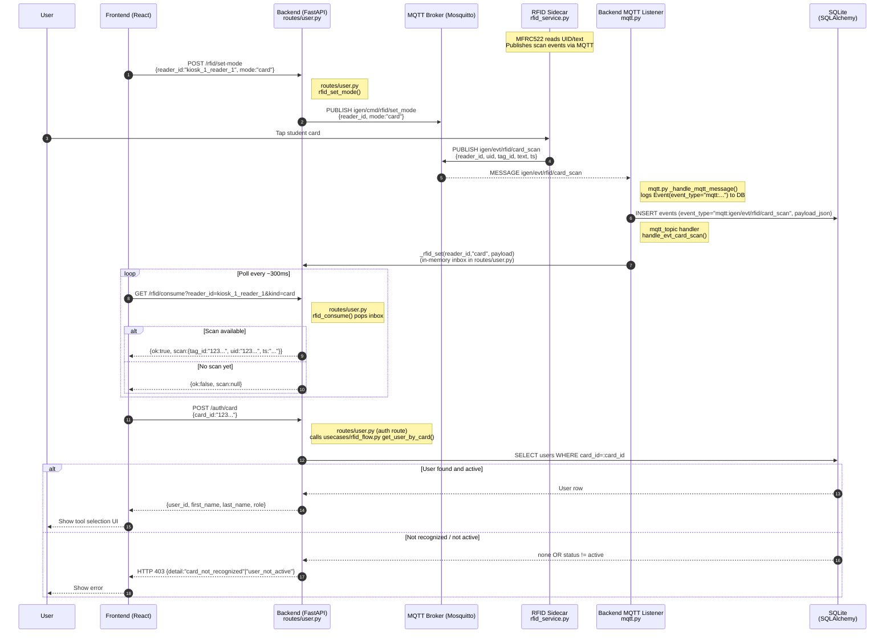
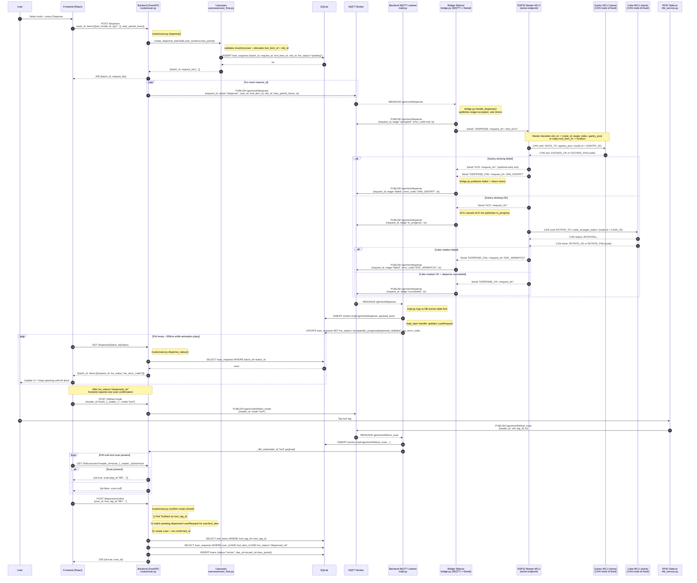
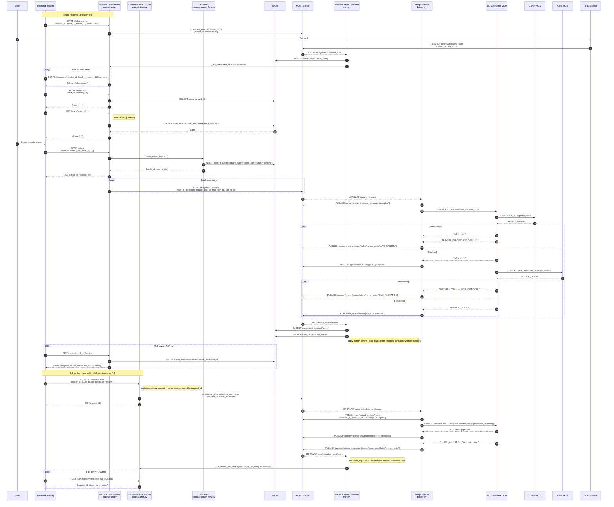

## Authentication

```mermaid

sequenceDiagram
    autonumber
    participant U as User
    participant FE as Frontend (React)
    participant BE as Backend (FastAPI)<br/>routes/user.py
    participant MQ as MQTT Broker (Mosquitto)
    participant RFID as RFID Sidecar<br/>rfid_service.py
    participant MQTT as Backend MQTT Listener<br/>mqtt.py
    participant DB as SQLite<br/>(SQLAlchemy)

    Note over RFID: MFRC522 reads UID/text<br/>Publishes scan events via MQTT

    %% Frontend prepares kiosk to accept card scans
    FE->>BE: POST /rfid/set-mode<br/>{reader_id:"kiosk_1_reader_1", mode:"card"}
    Note right of BE: routes/user.py<br/>rfid_set_mode()
    BE->>MQ: PUBLISH igen/cmd/rfid/set_mode<br/>{reader_id, mode:"card"}

    %% User taps card; RFID service publishes scan
    U->>RFID: Tap student card
    RFID->>MQ: PUBLISH igen/evt/rfid/card_scan<br/>{reader_id, uid, tag_id, text, ts}

    %% Backend MQTT listener logs event and updates in-memory inbox
    MQ-->>MQTT: MESSAGE igen/evt/rfid/card_scan
    Note right of MQTT: mqtt.py _handle_mqtt_message()<br/>logs Event(event_type="mqtt:...") to DB
    MQTT->>DB: INSERT events (event_type="mqtt:igen/evt/rfid/card_scan", payload_json)
    Note right of MQTT: mqtt_topic handler<br/>handle_evt_card_scan()
    MQTT->>BE: _rfid_set(reader_id,"card", payload)<br/>(in-memory inbox in routes/user.py)

    %% Frontend polls until scan appears
    loop Poll every ~300ms
        FE->>BE: GET /rfid/consume?reader_id=kiosk_1_reader_1&kind=card
        Note right of BE: routes/user.py<br/>rfid_consume() pops inbox
        alt Scan available
            BE-->>FE: {ok:true, scan:{tag_id:"123...", uid:"123...", ts:"..."}}
        else No scan yet
            BE-->>FE: {ok:false, scan:null}
        end
    end

    %% Frontend performs DB-backed auth using card_id/tag_id
    FE->>BE: POST /auth/card<br/>{card_id:"123..."}
    Note right of BE: routes/user.py (auth route)<br/>calls usecases/rfid_flow.py get_user_by_card()
    BE->>DB: SELECT users WHERE card_id=:card_id
    alt User found and active
        DB-->>BE: User row
        BE-->>FE: {user_id, first_name, last_name, role}
        FE-->>U: Show tool selection UI
    else Not recognized / not active
        DB-->>BE: none OR status != active
        BE-->>FE: HTTP 403 {detail:"card_not_recognized"|"user_not_active"}
        FE-->>U: Show error
    end


```

## Dispense

```mermaid

sequenceDiagram
    autonumber
    participant U as User
    participant FE as Frontend (React)
    participant BE as Backend (FastAPI)<br/>routes/user.py
    participant UC as Usecases<br/>usecases/user_flow.py
    participant DB as SQLite
    participant MQ as MQTT Broker
    participant MQTT as Backend MQTT Listener<br/>mqtt.py
    participant BR as Bridge Sidecar<br/>bridge.py (MQTT<->Serial)
    participant ESPM as ESP32 Master MCU<br/>(serial endpoint)
    participant GAN as Gantry MCU (slave)<br/>(CAN node id fixed)
    participant CAK as Cake MCU (slave)<br/>(CAN node id fixed)
    participant RFID as RFID Sidecar<br/>rfid_service.py

    %% ========== DISPENSE REQUEST ==========
    U->>FE: Select tools + press Dispense
    FE->>BE: POST /dispense<br/>{user_id, items:[{tool_model_id, qty?...}], loan_period_hours}
    Note right of BE: routes/user.py dispense()
    BE->>UC: create_dispense_batch(db,user_id,items,loan_period)
    Note right of UC: validates inventory/user + allocates tool_item_id + slot_id
    UC->>DB: INSERT loan_requests (batch_id, request_id, tool_item_id, slot_id, hw_status="pending")
    DB-->>UC: ok
    UC-->>BE: {batch_id, request_ids:[...]}
    BE-->>FE: 200 {batch_id, request_ids}

    %% Publish hardware commands (one per request_id)
    loop For each request_id
        BE->>MQ: PUBLISH igen/cmd/dispense<br/>{request_id, action:"dispense", user_id, tool_item_id, slot_id, loan_period_hours, ts}
    end

    %% ========== HARDWARE PIPELINE ==========
    MQ-->>BR: MESSAGE igen/cmd/dispense
    Note right of BR: bridge.py handle_dispense()<br/>publishes stage=accepted, sets timers
    BR->>MQ: PUBLISH igen/evt/dispense<br/>{request_id, stage:"accepted", error_code:null, ts}
    BR->>ESPM: Serial: "DISPENSE <request_id> <slot_id>\n"

    %% Master MCU expands into slave sequence (gantry then cake)
    Note over ESPM,GAN: Master decodes slot_id -> (cake_id, target_index, gantry_pos)<br/>or maps tool_item_id -> location
    ESPM->>GAN: CAN cmd: DOCK_TO <gantry_pos> (node id = GANTRY_ID)
    GAN-->>ESPM: CAN ack: DOCKED_OK or DOCKED_FAIL(code)

    alt Gantry docking failed
        ESPM-->>BR: Serial "ACK <request_id>" (optional early ack)
        ESPM-->>BR: Serial "DISPENSE_FAIL <request_id> JAM_GANTRY"
        Note right of BR: bridge.py publishes failed + clears timers
        BR->>MQ: PUBLISH igen/evt/dispense<br/>{request_id, stage:"failed", error_code:"JAM_GANTRY", ts}
    else Gantry docking OK
        ESPM-->>BR: Serial "ACK <request_id>"
        Note right of BR: ACK cancels ACK tim publishes in_progress
        BR->>MQ: PUBLISH igen/evt/dispense<br/>{request_id, stage:"in_progress", ts}

        ESPM->>CAK: CAN cmd: ROTATE_TO <cake_id,target_index> (node id = CAKE_ID)
        CAK-->>ESPM: CAN status: ROTATING...
        CAK-->>ESPM: CAN done: ROTATE_OK or ROTATE_FAIL(code)

        alt Cake rotation failed
            ESPM-->>BR: Serial "DISPENSE_FAIL <request_id> ENC_MISMATCH"
            BR->>MQ: PUBLISH igen/evt/dispense<br/>{request_id, stage:"failed", error_code:"ENC_MISMATCH", ts}
        else Cake rotation OK + dispense succeeded
            ESPM-->>BR: Serial "DISPENSE_OK <request_id>"
            BR->>MQ: PUBLISH igen/evt/dispense<br/>{request_id, stage:"succeeded", ts}
        end
    end

    %% ========== BACKEND EVENT APPLY ==========
    MQ-->>MQTT: MESSAGE igen/evt/dispense
    Note right of MQTT: mqtt.py logs to DB events table first
    MQTT->>DB: INSERT events (mqtt:igen/evt/dispense, payload_json)
    Note right of MQTT: mqtt_topic handler updates LoanRequest
    MQTT->>DB: UPDATE loan_requests SET hw_status="accepted|in_progress|dispensed_ok|failed", hw_error_code...

    %% ========== FRONTEND POLLING ==========
    loop Poll every ~500ms while animation plays
        FE->>BE: GET /dispense/{batch_id}/status
        Note right of BE: routes/user.py dispense_status()
        BE->>DB: SELECT loan_requests WHERE batch_id=:batch_id
        DB-->>BE: rows
        BE-->>FE: {batch_id, items:[{request_id, hw_status, hw_error_code?}]}
        FE-->>U: Update UI + keep spinning until all done
    end

    %% ========== TOOL CONFIRMATION (post-success) ==========
    Note over FE,BE: After hw_status="dispensed_ok"<br/>frontend requires tool scan confirmation

    FE->>BE: POST /rfid/set-mode<br/>{reader_id:"kiosk_1_reader_1", mode:"tool"}
    BE->>MQ: PUBLISH igen/cmd/rfid/set_mode<br/>{reader_id, mode:"tool"}

    U->>RFID: Tap tool tag
    RFID->>MQ: PUBLISH igen/evt/rfid/tool_scan<br/>{reader_id, uid, tag_id, ts}

    MQ-->>MQTT: MESSAGE igen/evt/rfid/tool_scan
    MQTT->>DB: INSERT events (mqtt:igen/evt/rfid/tool_scan,...)
    MQTT->>BE: _rfid_set(reader_id,"tool",payload)

    loop Poll until tool scan present
        FE->>BE: GET /rfid/consume?reader_id=kiosk_1_reader_1&kind=tool
        alt Scan present
            BE-->>FE: {ok:true, scan:{tag_id:"987..."}}
        else
            BE-->>FE: {ok:false, scan:null}
        end
    end

    %% Confirm pickup in DB (you need this route/usecase)
    FE->>BE: POST /dispense/confirm<br/>{user_id, tool_tag_id:"987..."}
    Note right of BE: routes/user.py (confirm route) should:
    Note right of BE: 1) find ToolItem by tool_tag_id
    Note right of BE: 2) match pending dispensed LoanRequest for user/tool_item
    Note right of BE: 3) create Loan + set confirmed_at
    BE->>DB: SELECT tool_items WHERE tool_tag_id=:tool_tag_id
    BE->>DB: SELECT loan_requests WHERE user_id AND tool_item_id AND hw_status="dispensed_ok"
    BE->>DB: INSERT loans (status="active", due_at=issued_at+loan_period)
    BE-->>FE: 200 {ok:true, loan_id}

```

## Return

```mermaid
sequenceDiagram
    autonumber
    participant U as User
    participant FE as Frontend (React)
    participant BEU as Backend User Routes<br/>routes/user.py
    participant BEA as Backend Admin Routes<br/>routes/admin.py
    participant UC as Usecases<br/>usecases/user_flow.py
    participant DB as SQLite
    participant MQ as MQTT Broker
    participant MQTT as Backend MQTT Listener<br/>mqtt.py
    participant BR as Bridge Sidecar<br/>bridge.py
    participant ESPM as ESP32 Master MCU
    participant GAN as Gantry MCU
    participant CAK as Cake MCU
    participant RFID as RFID Sidecar

    %% ================= RETURN: require card scan first (your UX rule) =================
    Note over FE,BEU: Return requires card scan first

    FE->>BEU: POST /rfid/set-mode<br/>{reader_id:"kiosk_1_reader_1", mode:"card"}
    BEU->>MQ: PUBLISH igen/cmd/rfid/set_mode<br/>{reader_id, mode:"card"}

    U->>RFID: Tap card
    RFID->>MQ: PUBLISH igen/evt/rfid/card_scan<br/>{reader_id, tag_id, ts}
    MQ-->>MQTT: MESSAGE igen/evt/rfid/card_scan
    MQTT->>DB: INSERT events(mqtt:...card_scan)
    MQTT->>BEU: _rfid_set(reader_id,"card",payload)

    loop Poll for card scan
        FE->>BEU: GET /rfid/consume?reader_id=kiosk_1_reader_1&kind=card
        BEU-->>FE: {ok:true/false, scan:?}
    end

    FE->>BEU: POST /auth/card<br/>{card_id: scan.tag_id}
    BEU->>DB: SELECT users by card_id
    BEU-->>FE: {user_id,...}

    %% Load active loans
    FE->>BEU: GET /loans?user_id=...
    Note right of BEU: routes/user.py loans()
    BEU->>DB: SELECT loans WHERE user_id AND returned_at IS NULL
    DB-->>BEU: loans
    BEU-->>FE: {loans:[...]}

    %% Start return batch
    U->>FE: Select tools to return
    FE->>BEU: POST /return<br/>{user_id, items:[{tool_item_id,...}]}
    BEU->>UC: create_return_batch(...)
    UC->>DB: INSERT loan_requests(request_type="return", hw_status="pending")
    UC-->>BEU: {batch_id, request_ids}
    BEU-->>FE: 200 {batch_id, request_ids}

    %% Publish return command(s)
    loop each request_id
        BEU->>MQ: PUBLISH igen/cmd/return<br/>{request_id, action:"return", user_id, tool_item_id, slot_id, ts}
    end

    %% Hardware: gantry then cake (reverse process if needed)
    MQ-->>BR: MESSAGE igen/cmd/return
    BR->>MQ: PUBLISH igen/evt/return {request_id, stage:"accepted"}
    BR->>ESPM: Serial "RETURN <request_id> <slot_id>\n"

    ESPM->>GAN: CAN DOCK_TO <gantry_pos>
    GAN-->>ESPM: DOCKED_OK/FAIL
    alt Dock failed
        ESPM-->>BR: "ACK <rid>"
        ESPM-->>BR: "RETURN_FAIL <rid> JAM_GANTRY"
        BR->>MQ: PUBLISH igen/evt/return {stage:"failed", error_code:"JAM_GANTRY"}
    else Dock ok
        ESPM-->>BR: "ACK <rid>"
        BR->>MQ: PUBLISH igen/evt/return {stage:"in_progress"}
        ESPM->>CAK: CAN ROTATE_TO <cake_id,target_index>
        CAK-->>ESPM: ROTATE_OK/FAIL
        alt Rotate fail
            ESPM-->>BR: "RETURN_FAIL <rid> ENC_MISMATCH"
            BR->>MQ: PUBLISH igen/evt/return {stage:"failed", error_code:"ENC_MISMATCH"}
        else Return ok
            ESPM-->>BR: "RETURN_OK <rid>"
            BR->>MQ: PUBLISH igen/evt/return {stage:"succeeded"}
        end
    end

    %% Backend applies return events to DB
    MQ-->>MQTT: MESSAGE igen/evt/return
    MQTT->>DB: INSERT events(mqtt:igen/evt/return)
    MQTT->>DB: UPDATE loan_requests.hw_status ...
    Note right of MQTT: apply_return_event() also marks Loan returned_at/status when succeeded

    %% Frontend polling on return batch
    loop Poll every ~500ms
        FE->>BEU: GET /return/{batch_id}/status
        BEU->>DB: SELECT loan_requests WHERE batch_id=:batch_id
        BEU-->>FE: {items:[{request_id, hw_status, hw_error_code?}]}
    end

    %% ================= ADMIN: MOTOR TEST (no DB updates) =================
    Note over FE,BEA: Admin test does not touch loans/inventory DB

    FE->>BEA: POST /admin/test/motor<br/>{motor_id: 2..10, action:"dispense"|"return"}
    Note right of BEA: routes/admin.py stores in-memory status keyed by request_id
    BEA->>MQ: PUBLISH igen/cmd/admin_test/motor<br/>{request_id, motor_id, action}
    BEA-->>FE: 200 {request_id}

    %% Bridge handles admin test topic and publishes admin test events
    MQ-->>BR: MESSAGE igen/cmd/admin_test/motor
    BR->>MQ: PUBLISH igen/evt/admin_test/motor<br/>{request_id, motor_id, action, stage:"accepted"}
    BR->>ESPM: Serial "DISPENSE|RETURN <rid> <motor_id>\n" (temporary mapping)

    %% Admin test completion event
    ESPM-->>BR: "ACK <rid>" (optional)
    BR->>MQ: PUBLISH igen/evt/admin_test/motor {stage:"in_progress"}
    ESPM-->>BR: "..._OK <rid>" OR "..._FAIL <rid> <err>"
    BR->>MQ: PUBLISH igen/evt/admin_test/motor {stage:"succeeded|failed", error_code?}

    %% Backend mqtt.py handler updates in-memory test status only
    MQ-->>MQTT: MESSAGE igen/evt/admin_test/motor
    Note right of MQTT: dispatch_mqtt -> handler updates admin in-memory store
    MQTT->>BEA: _set_motor_test_status(request_id, payload) (in-memory)

    %% Frontend polling test status
    loop Poll every ~300ms
        FE->>BEA: GET /admin/test/motor/{request_id}/status
        BEA-->>FE: {request_id, stage, error_code?}
    end
```