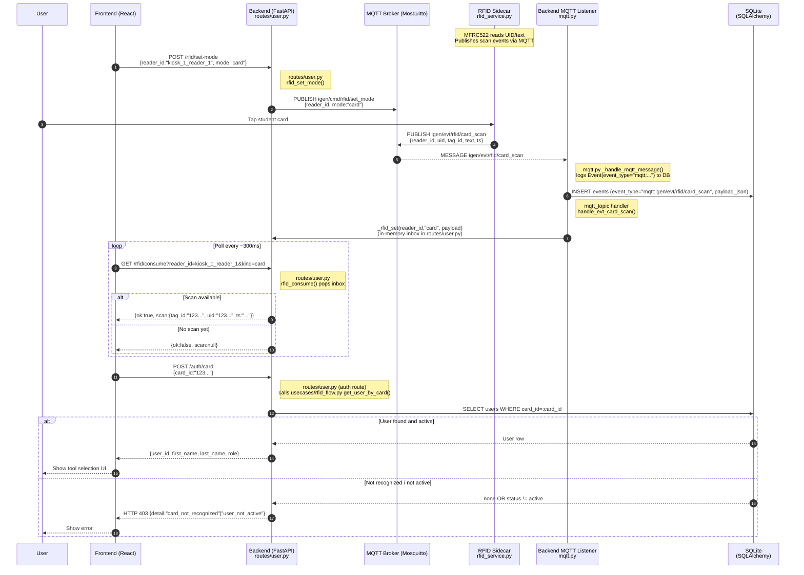
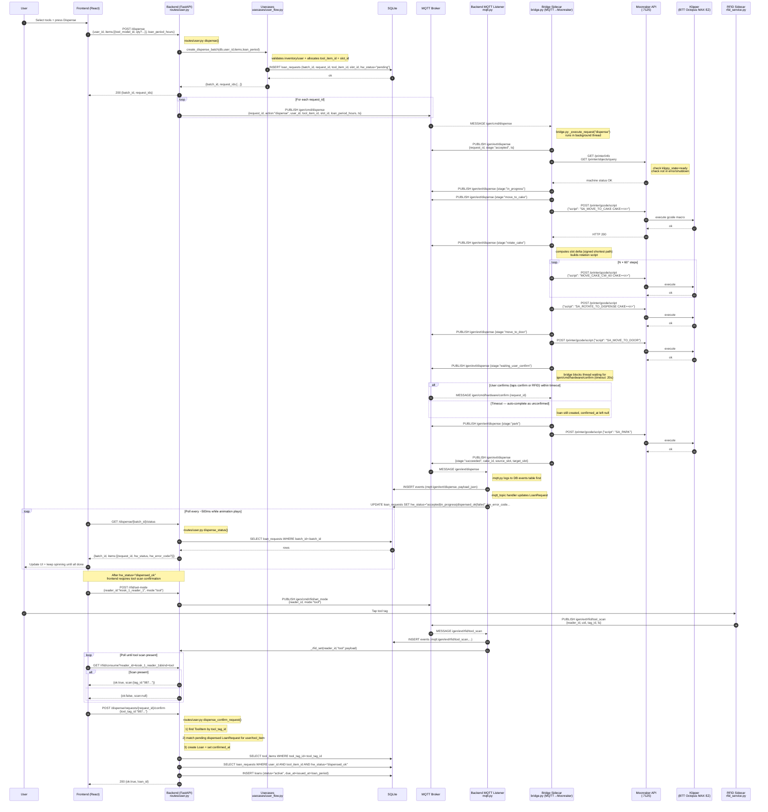
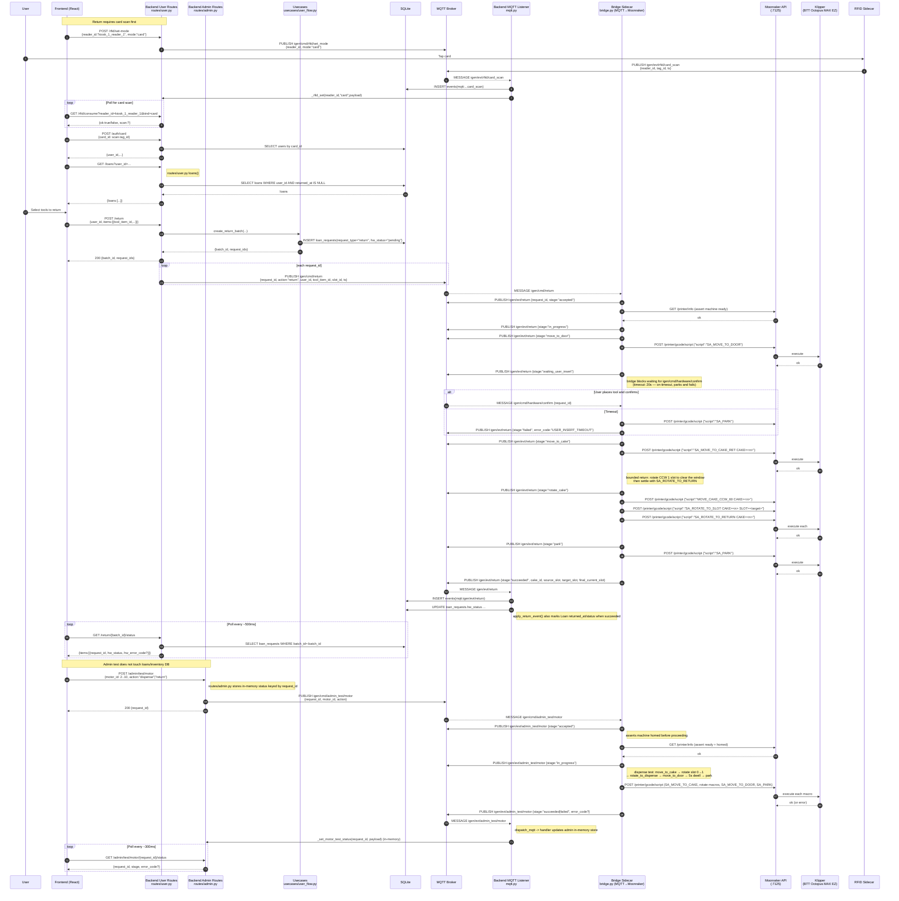

# HAVEN: System Sequence Diagrams

Full-detail sequence diagrams for each major flow.

**Hardware note:** All motor control goes through Klipper via the Moonraker HTTP API. The Bridge sidecar (`bridge.py`) translates MQTT commands into G-code macros (`SA_MOVE_TO_CAKE`, `SA_ROTATE_TO_DISPENSE`, `SA_PARK`, etc.) sent to `POST /printer/gcode/script`. There is no serial protocol to an ESP32 or CAN bus. The sequence diagrams below abbreviate this as "Bridge → Klipper" for readability.

For a detailed breakdown of what the bridge does per step see [`comms-topology.md`](comms-topology.md).

---

## Authentication

## Dispense

## Return
